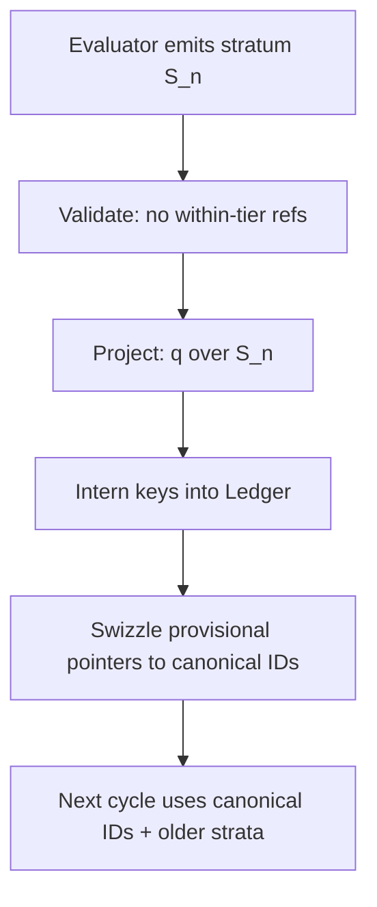

# in-16.md — Homomorphic Collapse of Evaluation and Canonicalization

## Purpose

This document specifies the **homomorphic unification** of the Prism execution engines:

1. **Evaluator / Manifest / Arena dynamics** (fast, provisional, schedule-sensitive)
2. **Canonicalizer / Ledger dynamics** (interned, univalent, schedule-invariant)

The goal is to make these two *projections of a single semantic system*, rather than competing implementations. This collapse is achieved by treating evaluation as a **write model** and canonicalization as a **read model**, linked by a rigorously defined **quotient homomorphism**.

This file is normative and intended to be integrated into `IMPLEMENTATION_PLAN` as the semantic contract governing convergence, univalence, and denotation invariance.

---

## Core Thesis

> **Evaluation and canonicalization are the same computation viewed through different homomorphic projections.**

* The **Evaluator** emits *claims about structure*.
* The **Ledger** enforces *structural identity*.
* A quotient map `q` identifies evaluator artifacts modulo canonical equivalence.

All correctness, convergence, and optimization guarantees flow from this separation.

---

## Objects and Spaces

### Term Algebra (Abstract)

* Signature Σ contains opcodes: `ZERO`, `SUC`, `ADD`, `MUL`, `COORD_*`, etc.
* All non-leaf operators are **binary (CNF-2)**.

### Provisional Space (Write Model)

* Objects: ephemeral node references (Manifest pointers / Arena indices).
* Identity: *accidental* (allocation-dependent).
* Dynamics: local rewrite, mutation, fresh allocation, scheduling freedom.

### Canonical Space (Read Model)

* Objects: Ledger node IDs.
* Identity: *structural*, enforced by full-key equality (univalence).
* Dynamics: intern, deduplicate, normalize.

---

## The Quotient Map `q`

Define a total map:

```
q : ProvisionalNode → CanonicalNodeID
```

Operational definition:

1. Read `(op, a1, a2)` from the provisional node.

2. Replace `a1`, `a2` with `q(a1)`, `q(a2)` (recursive projection).

3. Canonicalize operands (e.g. commutativity, coordinate normalization).

4. Construct the **semantic key**:

   ```
   Key(K) = encode(op) || encode(q(a1)) || encode(q(a2)) || encode(op-specific extras)
   ```

5. Intern the key into the Ledger; return the canonical ID.

This map is **univalent**: equal keys imply equal IDs; unequal keys must never alias.

---

## Homomorphism Laws

### Structural Homomorphism

For every operator `f ∈ Σ`:

```
q(f_M(x, y)) = f_L(q(x), q(y))
```

That is, *construct then project* equals *project then construct*.

### Dynamic Simulation (Weak Form)

For every evaluator step:

```
p →_Eval p'
```

There exists a finite number of canonical steps such that:

```
q(p) →*_Canon q(p')
```

This allows evaluator freedom while preserving semantic meaning.

---

## CNF-2 and Bounded Emission

All Prism nodes obey **Chomsky Normal Form (arity ≤ 2)**.

Rewrite rules must satisfy:

* Each rewrite emits a **bounded number** of new CNF-2 claims (typically ≤ 2).
* No rewrite introduces higher-arity or variadic structure.

This bounded fanout ensures:

* batchability,
* scheduler independence,
* global convergence under interning.

---

## Strata Discipline (No Within-Tier References)

Evaluation proceeds in **strata**:

* A stratum is a batch of newly emitted provisional nodes.
* Nodes in stratum `S_n` may only reference canonical IDs or nodes from `S_<n`.
* **No node may reference another node in the same stratum.**

Consequences:

* canonicalization can be applied stratum-by-stratum,
* projection `q` is well-founded,
* swizzling to canonical IDs is unambiguous.

---

## Coordinates as First-Class Canonical Objects

Coordinate data (`COORD_ZERO`, `COORD_ONE`, `COORD_PAIR`) are not metadata.

They are:

* interned CNF-2 nodes in the same Ledger,
* normalized via structural recursion,
* compared by pointer equality.

Aggregation (e.g. XOR / parity cancellation) is expressed as **structural rewriting over coordinate nodes**, not as numeric accumulation.

This exposes global cancellations independent of tree shape or scheduling.

---

## Scheduler Freedom and Denotation Invariance

Arena scheduling mechanisms (rank, sort, Morton order, blocking) are **performance-only**.

Required invariant:

> Any two evaluator executions with different schedules must project via `q` to the same canonical result.

Formally:

```
q(eval_sched1(p)) = q(eval_sched2(p))
```

Violation of this invariant is a semantic bug, not an optimization issue.

---

## Convergence and Fixed Points

A computation is **converged** when applying `q` yields a fixed point:

```
q(p) = q(p')
```

for all further evaluator steps `p → p'`.

Hyperemergent convergence arises from:

* bounded local emission,
* global univalent interning,
* coordinate-based aggregation.

Global normalization is therefore enforced without requiring global synchronization.

---

## Testing and Verification Obligations

Implementations MUST provide:

1. **Univalence tests**

   * Distinct semantic keys never alias.
   * Hashes are hints only; full-key equality decides identity.

2. **Denotation invariance tests**

   * Run identical programs under multiple schedulers.
   * Compare canonical IDs or decoded normal forms.

3. **Stratum validity checks** (debug / gated)

   * No within-tier references.

4. **Milestone-gated validation**

   * All features introduced at milestone `m_k` must preserve invariants of `m_<k`.

---

## Implementation Guidance (Non-Normative)

* Treat evaluator allocations as **events**; Ledger as a **materialized view**.
* Prefer batch interning at stratum boundaries.
* Avoid truncating IDs or keys in ways that threaten univalence.
* Coordinate normalization should be idempotent under interning.

---

## Summary

The collapse of evaluation and canonicalization is achieved by:

* enforcing CNF-2 structure,
* defining a total univalent quotient map `q`,
* separating write-time freedom from read-time identity,
* and making denotation invariance the core correctness criterion.

Under these rules, Prism exhibits robust, schedule-independent convergence through homomorphic projection rather than brittle global control.

---

# Appendix A — One-Page Contract (Reviewer Version)

## Scope

This contract governs the semantic unification of Prism’s **Evaluator** (Manifest/Arena) and **Canonicalizer** (Ledger). The Evaluator may reorder, mutate, and allocate freely for performance; the Canonicalizer enforces canonical identity and meaning.

## Terms

* **Provisional node**: ephemeral pointer/address produced by evaluator dynamics.
* **Canonical node**: interned Ledger ID determined by full semantic key.
* **Stratum**: a batch of provisional nodes emitted in one evaluation cycle.
* **Quotient map** `q`: projection from provisional nodes to canonical IDs.

## Non-Negotiable Invariants

1. **CNF-2**: all non-leaf nodes are binary `(op,a1,a2)`.
2. **Univalence**: full semantic key equality decides identity; unequal keys never alias.
3. **Strata discipline**: no within-tier references (new nodes reference only older strata or canonical IDs).
4. **Denotation invariance**: any scheduling/permutation/partitioning changes performance only, not meaning.

## Required Laws

* **Structural homomorphism**: `q(construct_E(op,x,y)) = construct_C(op,q(x),q(y))` after canonicalization.
* **Dynamic simulation (weak)**: if `p →_Eval p'` then `q(p) →*_Canon q(p')`.

## Acceptance Criteria

* For every program `P` and any two schedules `S1,S2`:

  * `q(eval(P,S1)) == q(eval(P,S2))`.
* Interning produces a unique ID for each semantic key and preserves it across time.
* Coordinate objects are first-class interned nodes and normalize idempotently.

## Required Tests

* Univalence tests (no key aliasing; hash is hint only).
* Denotation invariance tests across schedulers.
* Stratum validity checks (debug/gated).

---

# Appendix B — Milestone Gating Alignment (m₁…mₙ)

This section makes the contract **progressively enforceable**. Each milestone adds capabilities while preserving prior invariants.

## m₁ — CNF-2 Core + Deterministic Keys

* Implement CNF-2 node representation for all supported ops.
* Implement semantic key encoding for `(op,a1,a2)` with commutativity canonicalization where applicable.
* Establish baseline univalence: full-key equality determines identity.

**Gate:**

* Key encoding round-trip tests.
* `intern(key)` is idempotent and collision-free under full-key equality.

## m₂ — Basic Evaluator Emission + Strata Boundaries

* Evaluator emits provisional nodes only in strata.
* Enforce **no within-tier references**.
* Provide boundary pass that projects the stratum through `q`.

**Gate:**

* Stratum validity checker.
* Projection `q` totality on emitted strata.

## m₃ — Canonical Rewrites + Denotation Invariance Harness

* Implement canonical rewrite steps in Ledger space (or rewrite+intern).
* Provide multi-scheduler evaluator runs and compare canonical outcomes.

**Gate:**

* Denotation invariance across at least: (a) unsorted, (b) rank bucketed, (c) Morton/block variants.

## m₄ — Coordinates as Interned Objects + Aggregation

* Represent coordinates as `COORD_ZERO/ONE/PAIR` interned CNF-2 nodes.
* Normalize coordinates idempotently; enable parity/XOR-style structural aggregation.

**Gate:**

* Coordinate normalization fixed-point tests.
* Cancellation correctness independent of adjacency/shape.

## m₅ — Full Homomorphic Collapse (Production Contract)

* Treat evaluator as write-model; ledger as read-model.
* Ensure every evaluator step projects to canonical meaning; schedule affects only performance.

**Gate:**

* Full-suite denotation invariance.
* Univalence stress tests at scale.
* Regression suite preserving all earlier milestone invariants.

> Notes:
>
> * Additional milestones (m₆+) may cover memory policy (ranks), compaction/GC, distributed shards, GPU-specific kernels, etc., but must not weaken the contract.

---

# Appendix C — Commuting Diagram + Pseudo-Code

## C.1 Commuting Diagram (Conceptual)

```mermaid
flowchart LR
  subgraph E[Evaluator Space (Provisional)]
    P0[p] -->|rewrite / schedule / allocate| P1[p']
  end

  subgraph C[Canonical Space (Ledger)]
    Q0[q(p)] -->|rewrite+intern| Q1[q(p')]
  end

  P0 -->|q| Q0
  P1 -->|q| Q1

  classDef ev fill:#f7f7ff,stroke:#777;
  classDef ca fill:#f7fff7,stroke:#777;
  class P0,P1 ev;
  class Q0,Q1 ca;
```

**Intended property:** the square commutes up to `→*` in the canonical space:

* `p →_Eval p'` implies `q(p) →*_Canon q(p')`.

## C.2 Stratum Boundary Diagram



## C.3 Pseudo-Code: Projection `q`

### Canonicalization helpers

* `canon_children(op, a1, a2)` applies:

  * leaf normalization rules (e.g., coord leaves have args=0),
  * commutativity order for `ADD/MUL`,
  * coordinate normalization for `COORD_PAIR` via idempotent recursion.

### Core projection

```text
function q(node_ref): CanonID
  if node_ref is CanonID:
    return node_ref

  if memo_q contains node_ref:
    return memo_q[node_ref]

  (op, a1, a2) = read_provisional(node_ref)

  c1 = q(a1)
  c2 = q(a2)

  (op', c1', c2') = canon_children(op, c1, c2)

  key = encode(op') || encode(c1') || encode(c2') || encode_extras(op', ...)

  id = ledger_intern(key, op', c1', c2')

  memo_q[node_ref] = id
  return id
```

## C.4 Pseudo-Code: Stratum Boundary

```text
function commit_stratum(stratum_nodes): list[CanonID]
  assert validate_no_within_tier_refs(stratum_nodes)

  # Project each provisional node to canonical ID
  canon_ids = []
  for n in stratum_nodes:
    canon_ids.append(q(n))

  # Optional: apply canonical rewrites to a frontier set
  # frontier' = canon_rewrite_fixpoint(canon_ids)

  # Swizzle: replace provisional references in evaluator state with canon IDs
  evaluator_swizzle_to_canonical(canon_ids)

  return canon_ids
```

## C.5 Implementation Notes (for reviewers)

* `memo_q` is mandatory for performance and termination (DAG sharing).
* The strata rule makes `q` well-founded and permits batched interning.
* If the evaluator mutates nodes in-place, it must do so only within its own provisional space; meaning is always measured after projection.